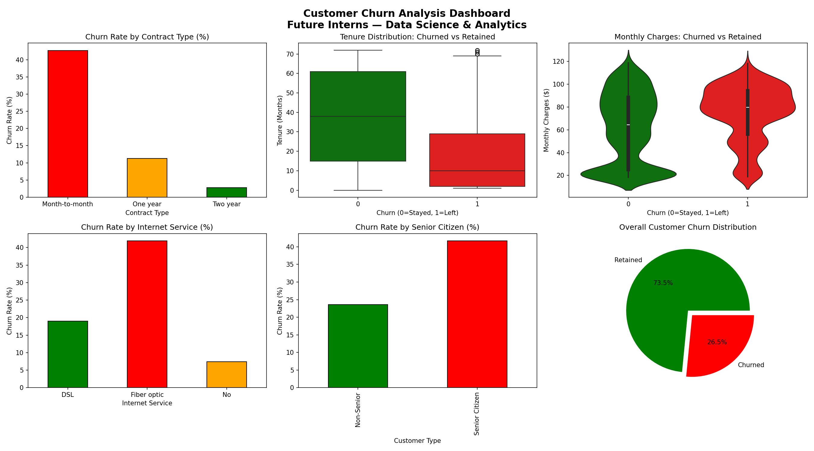
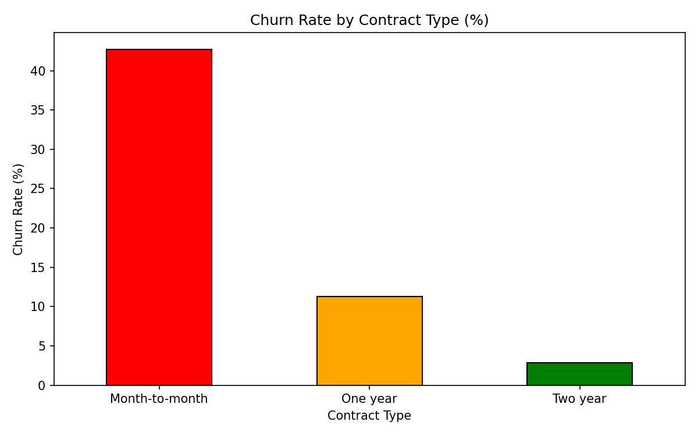
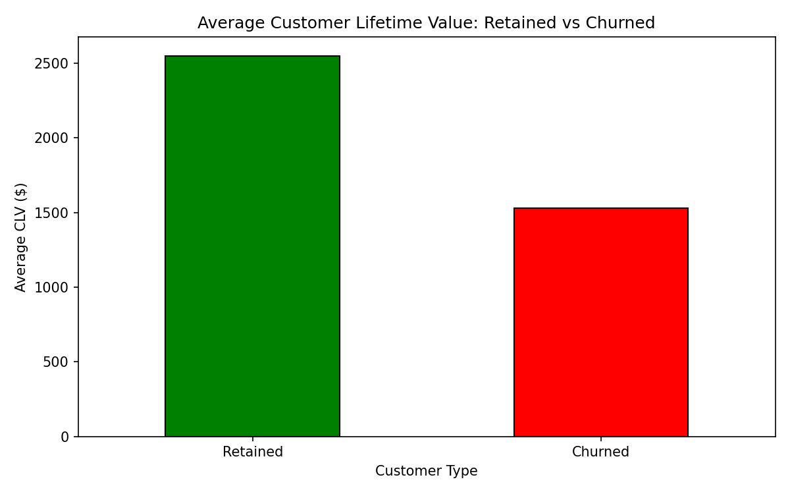

# 📉 Customer Retention & Churn Analysis

---

## 📌 Objective
Analyze Telco customer data to identify churn patterns, 
key retention drivers, and customer lifetime trends — 
and provide actionable recommendations to reduce churn.

---

## 📂 Project Structure
Customer-churn-Analysis/
│
├── data/
│   └── WA_Fn-UseC_-Telco-Customer-Churn.csv
├── churn_analysis.ipynb
├── contract_churn.png
├── tenure_churn.png
├── charges_churn.png
├── internet_churn.png
├── Senior_citizen_churn.png
├── overall_churn.png
├── clv_analysis.png
├── churn_dashboard.png
└── README.md

---

## 📊 Dataset Info
- **Source:** Kaggle — IBM Telco Customer Churn
- **Records:** 7,043 customers | 21 columns
- **Domain:** Telecom subscription business

---

## 🔍 Analysis Performed
1. Overall Churn Rate Analysis
2. Contract Type vs Churn
3. Tenure vs Churn (Boxplot)
4. Monthly Charges vs Churn (Violin Plot)
5. Internet Service vs Churn
6. Senior Citizen vs Churn
7. Customer Lifetime Value Analysis

---

## 📸 Visualizations

### Churn Dashboard

### Contract Type vs Churn

### Customer Lifetime Value

## 💡 Key Findings
- Overall churn rate: **26.54%** (1 in 4 customers left!)
- Month-to-month contracts: **42.71%** churn rate
- Month-to-month contracts churn at **15x higher rate** than two-year plans
- Two year contracts: only **2.83%** churn rate
- Churned customers stayed only **17.97 months** on average
- Churned customers paid **$74.44/month** vs $61.27 retained
- Fiber optic customers: **41.89%** churn rate
- Senior citizens: **41.68%** churn rate
- Total estimated revenue lost: **~$1.9 Million!**

---

## 📌 Business Recommendations
1. Reduce monthly charges to retain high paying customers
2. Offer special discounts to senior citizens
3. Improve Fiber Optic service quality and speed
4. Incentivize customers to switch to annual/two-year plans
5. Bundle entertainment benefits like Netflix/Amazon Prime

---

## 🛠️ Tools Used
- **Python 3** — Core programming
- **Pandas** — Data cleaning and manipulation
- **Matplotlib** — Visualizations
- **Seaborn** — Statistical plots
- **VS Code + Jupyter Notebook** — Development environment

---

## 📁 Deliverables
- `churn_analysis.ipynb` — Complete analysis notebook
- `churn_dashboard.png` — Client ready combined dashboard
- Individual charts for each analysis

---

## 👤 Author
Anupama G
Data Science Student
